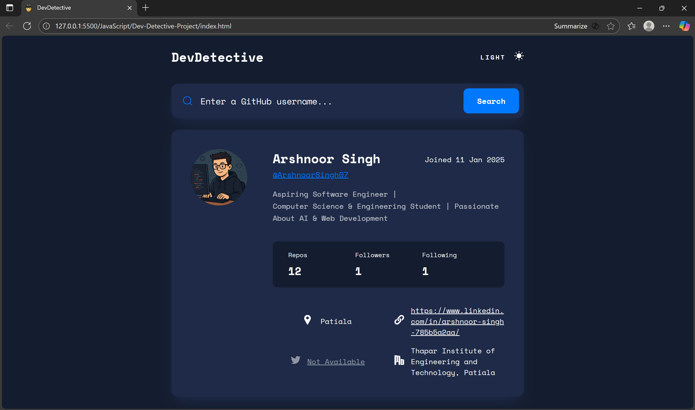
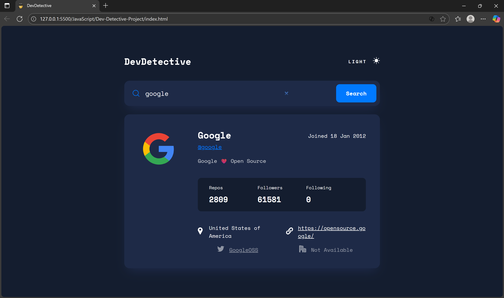

# Dev-Detective-Project

DevDetective is a responsive web application that allows users to search for GitHub profiles by username.  
It retrieves data from the public GitHub REST API and displays detailed information such as name, bio, repositories, followers, and social links.  
The project includes a light/dark theme toggle and a fully responsive design for an optimized user experience across all devices.

---

## Screenshot




---

## Overview

DevDetective provides an interactive interface for exploring GitHub user profiles.  
Users can search for any GitHub account and view profile information such as repositories, followers, company, and location.  
The application also supports light and dark modes, with user preferences saved in local storage.

---

## Features

- **GitHub User Search:** Fetches live data using the GitHub REST API.  
- **Detailed Profile View:** Displays user avatar, username, name, bio, and repository statistics.  
- **Error Handling:** Shows a message for invalid or non-existent usernames.  
- **Dark/Light Mode:** Supports manual toggling and automatic system preference detection.  
- **Responsive Layout:** Optimized for desktop, tablet, and mobile devices.  
- **Local Storage:** Remembers theme preferences between sessions.

---

## Project Structure

```
Dev-Detective-Project/
│
├── index.html          # Main HTML file
├── styles.css          # CSS styles and responsive design
├── script.js           # JavaScript logic and API handling
│
├── assets/
│   ├── images/
│   │   ├── search-icon.svg
│   │   ├── moon-icon.svg
│   │   ├── sun-icon.svg
│   │   ├── location-icon.svg
│   │   ├── twitter-icon.svg
│   │   ├── company-icon.svg
│   │   ├── website-icon.svg
│   ├── favicon-16x16.png
│   ├── favicon-32x32.png
│   ├── apple-touch-icon.png
│   ├── site.webmanifest
│   ├── homepage.png                # Homepage screenshot
│   └── Search.png                  # Search results screenshot
│
└── README.md                       # Project documentation
```

---

## Technologies Used

- **HTML5** – Semantic markup structure  
- **CSS3** – Styling, layout, and responsive design using media queries  
- **JavaScript (ES6)** – DOM manipulation and API integration  
- **GitHub REST API** – Fetching public user data.

---

## How It Works

1. The user enters a GitHub username in the search bar.  
2. The app sends a request to the GitHub API at:  
   ```
   https://api.github.com/users/{username}
   ```
3. If the user exists, profile data (e.g., name, avatar, repos, followers) is displayed.  
4. If the user does not exist, an error message appears.  
5. The theme toggle allows switching between light and dark modes, which are saved using `localStorage`.

---

## Setup Instructions

1. **Clone the repository**
   ```bash
   git clone https://github.com/ArshnoorSingh07/Dev-Detective-Project.git
   ```

2. **Navigate into the project directory**
   ```bash
   cd Dev-Detective-Project
   ```

3. **Open the project**
   Open the `index.html` file directly in your browser,  
   or use a live server for a better development experience.

4. **Search a GitHub user**
   Enter any GitHub username (for example, `octocat`) and click the **Search** button.

---

## API Reference

**Endpoint:**  
```
GET https://api.github.com/users/{username}
```

**Example Response:**
```json
{
  "login": "octocat",
  "name": "The Octocat",
  "avatar_url": "https://avatars.githubusercontent.com/u/583231?v=4",
  "bio": "GitHub mascot",
  "public_repos": 8,
  "followers": 9000,
  "following": 9,
  "location": "San Francisco",
  "twitter_username": "github",
  "company": "@GitHub"
}
```

---

## Future Enhancements

- Display a list of repositories with pagination  
- Add contribution graphs using the GitHub GraphQL API  
- Implement a search history feature  
- Improve accessibility and keyboard navigation  
- Convert the project into a Progressive Web App (PWA)

---

## License

This project is licensed under the **MIT License**.  
You are free to use, modify, and distribute this project with attribution.

---

## Author

**Arshnoor Singh**  
GitHub: [https://github.com/ArshnoorSingh07](https://github.com/ArshnoorSingh07)
